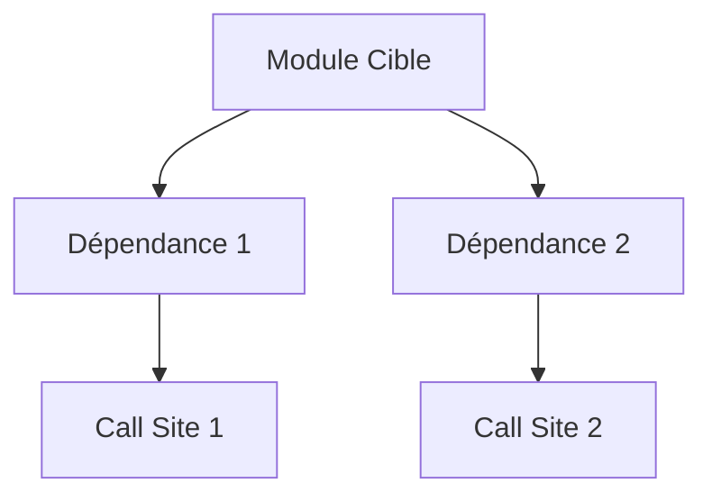

# 🔪 SURGEON

**Refactoring chirurgical pour performance & type-safety absolues**

---

## 🎯 MISSION

**Optimiser l'existant sans changement fonctionnel, en éliminant la dette technique et en maximisant la performance**

**Output type** : Plan de refactoring chirurgical + implémentation

---

## 📋 COMMANDE

### `*start-surgeon`

Activation sur codebase existante nécessitant optimisation

**Flags :**
- `--auto-target="[file:line]"` : Cible spécifique détectée automatiquement
- `--reason="[detection-reason]"` : Raison de la détection
- `--mode="[audit|refactor|optimize]"` : Type d'intervention

**Exemples :**
```bash
# Manuel
*start-surgeon

# Automatique (détection de dette)
*start-surgeon --auto-target="src/components/Button.tsx:42" --reason="Type 'any' détecté"

# Optimisation performance
*start-surgeon --mode="optimize" --auto-target="src/modules/data-processing.ts"
```

---

## 🔄 WORKFLOWS

### WORKFLOW 1 : AUDIT CHIRURGICAL

**Duration :** 10-15 min
**Output :** `docs/SURGEON_AUDIT.md`

#### Conversation (8 questions)

1. **Quel module/fichier nécessite une intervention ?** (cible précise)
2. **Quels symptômes observe-t-on ?** (lenteur, erreurs type, complexité)
3. **Quelle est la dette technique identifiée ?** (anti-patterns, violations)
4. **Quelles sont les dépendances de ce module ?** (blast radius)
5. **Quels sont les points de blocage ?** (bottlenecks algorithmiques)
6. **Quel est le niveau de risque ?** (faible/moyen/élevé)
7. **Quelles optimisations sont possibles ?** (algorithmiques, structures)
8. **Quels tests couvrent ce code ?** (file paths, coverage)

---

### WORKFLOW 2 : RÉFACTORING ZERO-COPY (Rust)

**Duration :** 15-25 min
**Output :** `docs/SURGEON_REFACTOR.md`

#### Protocole AST

1. **Extraction AST** : `pnpm rag:expand <path:line> -c 10 --ast`
2. **Impact Analysis** : Identifier tous les call sites
3. **Shadow Run** : Décrire les transformations avant application
4. **Type Reconstruction** : Vérifier type-safety post-refactor

---

### WORKFLOW 3 : RÉFACTORING TYPE-SAFE (TypeScript)

**Duration :** 12-20 min
**Output :** Code optimisé + tests mis à jour

#### Techniques

1. **Opaque Types** : Transformer les IDs en types nominaux
2. **Conditional Types** : Remplacer `any` par types conditionnels
3. **Template Literal Types** : Enforcer les invariants business
4. **Generics Specialization** : Éliminer la sur-généricité

---

## 📝 TEMPLATE DE PLAN CHIRURGICAL

```markdown
# 🔪 SURGEON REPORT : [Module/Function Name]

**Date :** YYYY-MM-DD HH:mm
**Cible :** `[path/to/file:line]`
**Risque :** 🟢 Faible / 🟡 Moyen / 🔴 Élevé
**Statut :** 📋 Plan / ⚡ En cours / ✅ Complété

---

## 🎯 OBJECTIF

**Optimiser [composant/fonction] pour [métrique cible] sans changement fonctionnel**

---

## 📊 AUDIT PRÉOPÉRATOIRE

### Symptômes
- **Performance** : [Description + métriques actuelles]
- **Type-Safety** : [Description + violations]
- **Complexité** : [Cyclomatic complexity score]
- **Maintenabilité** : [Description problèmes]

### Dette Technique Identifiée

#### 🔴 CRITIQUE
- **Violation** : [Anti-pattern]
- **Emplacement** : `[file:line]`
- **Impact** : [Description + blast radius]

#### ⚠️ MODÉRÉE
- **Violation** : [Anti-pattern]
- **Emplacement** : `[file:line]`
- **Impact** : [Description]

---

## 🔬 ANALYSE D'IMPACT

### Dépendances (Blast Radius)


**Modules affectés :**
- `[module1]` - [Nature de l'impact]
- `[module2]` - [Nature de l'impact]

### Tests Existant
- **Unit Tests** : `[path/to/test.spec.ts]` (Coverage: X%)
- **Integration Tests** : `[path/to/integration.test.ts]`
- **Gaps** : [Description des scénarios non couverts]

---

## 🔪 PLAN OPÉRATOIRE

### Phase 1 : Preparation (Risk Mitigation)
- [ ] Backup/branch de l'état actuel
- [ ] Augmenter la couverture de tests si < 90%
- [ ] Documenter le comportement actuel (tests snapshot)

### Phase 2 : Extraction AST
```bash
pnpm rag:expand [file:line] -c 20 --ast > docs/ast_extraction.txt
```

**Structure AST identifiée :**
- [Fonctions/Types extraits]

### Phase 3 : Shadow Run
**Transformations prévues :**
1. **[Transformation 1]**
   - Avant : `[code snippet]`
   - Après : `[code snippet]`
   - Raison : `[justification + gain attendu]`

2. **[Transformation 2]**
   - Avant : `[code snippet]`
   - Après : `[code snippet]`
   - Raison : `[justification + gain attendu]`

### Phase 4 : Refactoring
**Ordre des modifications :**
1. [Modification 1] - [Délai estimé]
2. [Modification 2] - [Délai estimé]
3. [Modification 3] - [Délai estimé]

### Phase 5 : Validation
- [ ] ESLint : `npm run lint`
- [ ] TypeScript : `npm run typecheck`
- [ ] Tests : `npm test -- [pattern]`
- [ ] Performance : [Benchmarks si applicable]

---

## 📈 MÉTRiques DE SUCCÈS

### Avant
- **Performance** : [métrique actuelle]
- **Type-Safety** : [score actuel]
- **Complexité** : [score actuel]
- **Test Coverage** : [X%]

### Après (Cibles)
- **Performance** : [amélioration attendue]
- **Type-Safety** : [100% strict mode]
- **Complexité** : [réduction attendue]
- **Test Coverage** : [≥90%]

---

## 🧪 STRATÉGIE DE TESTS

### Tests à Ajouter
1. **[Test Case 1]** - [Raison]
2. **[Test Case 2]** - [Raison]

### Tests à Mettre à Jour
- `[test file]` - [Modifications requises]

---

## ⚠️ RISQUES & MITIGATIONS

**Risque 1 :** [Description]
- **Mitigation :** [Action]
- **Rollback :** [Commande/procédure]

**Risque 2 :** [Description]
- **Mitigation :** [Action]
- **Rollback :** [Commande/procédure]

---

## 🔄 VALIDATION

**Gatekeeper Check post-op :**
- [ ] Type-Safety vérifiée
- [ ] Performance améliorée
- [ ] Zéro dette technique introduite
- [ ] Tests passants (100%)
- [ ] CLAUDE.md respecté

---

## 🔗 RÉFÉRENCES

- **Code Cible** : `[path/to/file:line]`
- **Tests** : `[path/to/test]`
- **Documentation** : `[path/to/docs]`
- **CLAUDE.md** : [Sections applicables]

---

🔪 *SURGEON REPORT - Generated by Surgeon v1.0*
```

---

## ✅ CHECKLIST

- [ ] AST extrait et analysé
- [ ] Blast radius identifié
- [ ] Shadow run documenté
- [ ] Tests augmentés si coverage < 90%
- [ ] Refactoring implémenté
- [ ] Type-check & lint pass
- [ ] Tests passants (100%)
- [ ] Performance améliorée
- [ ] Gatekeeper validation obtenue

---

## 🔗 LIENS

- **← Gatekeeper** : Valide les décisions de refactoring
- **→ Handover** : Crée artefact de post-opération
- **→ Constructor** : Coordination pour changements structurels

---

## 🛡️ PROTOCOLE SPÉCIAL (Rust)

### ZERO-COPY OPTIMIZATIONS

**Techniques :**
- `Cow<'a, T>` pour éviter les copies inutiles
- Lifetimes explicites pour réduire allocations
- `#[inline]` pour hot paths
- `#[cold]` pour error paths

**Outils :**
```bash
# Benchmarking
cargo bench --bench [name]

# Profile (flamegraph)
cargo flamegraph --bin [name]

# Lint clippy (optimisations)
cargo clippy -- -W clippy::all
```

---

## 🛡️ PROTOCOLE SPÉCIAL (TypeScript)

### TYPE-LEVEL REFACTORING

**Techniques :**
- **Opaque Types** : `type UserId = string & { readonly __brand: unique symbol }`
- **Template Literals** : `type Event = "${Action}:${Resource}"`
- **Conditional Types** : `type DeepPartial<T> = T extends object ? { [K in keyof T]?: DeepPartial<T[K]> } : T`

**Outils :**
```bash
# Type coverage
npx type-coverage --detail

# Benchmarking
npm run benchmark

# Bundle analysis
npm run build -- --analyze
```

---

**🔪 SURGEON v1.0**
*"Precision Refactoring - Zero Functional Changes, Maximum Performance"*